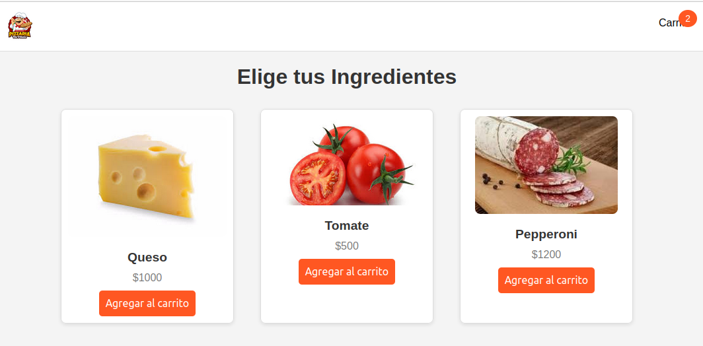

## Estructura del Proyecto

El proyecto consta de los siguientes archivos y carpetas:

1. **`index.html`:** Contiene la estructura de la página principal donde los usuarios seleccionan los ingredientes.
2. **`cart.html`:** Página donde se muestra el resumen de los ingredientes seleccionados en el carrito.
3. **`styles.css`:** Archivo de estilos que define la apariencia de la aplicación.
4. **`script.js`:** Archivo que contiene la lógica de la aplicación en JavaScript, incluyendo la manipulación del DOM y la gestión del carrito.
5. **`ingredients.json`:** Archivo JSON que contiene la lista de ingredientes y sus respectivas propiedades (nombre, precio, imagen).

## Instalación

1. **Clona el repositorio:**

    ```bash
    git clone https://github.com/KingNewbie/Javascript_CoderHouse/tree/main/Javascript_four_delivery
    ```

2. **Navega al directorio del proyecto:**

    ```bash
    cd Javascript_third_delivery
    ```

3. **Inicia un servidor local (opcional pero recomendado):**

    Si estás desarrollando localmente, es recomendable iniciar un servidor local para evitar problemas de CORS con `fetch`.

    - **Usando Python:**
    
      ```bash
      python3 -m http.server
      ```
      
    - **Usando Live Server en Visual Studio Code:**
    
      Instala la extensión Live Server y abre el proyecto con ella.

4. **Abre `index.html` en tu navegador:**

    ```bash
    http://localhost:8000
    ```

## Uso

    Abre index.html en tu navegador web favorito para iniciar la aplicación.
    Selecciona los ingredientes que deseas añadir a tu pizza y haz clic en "Agregar al carrito".
    Haz clic en el icono del carrito para ver los ingredientes seleccionados y gestionar tu pedido.

## Descripción del Código

### HTML


- **`index.html`:** Define la estructura principal de la página de selección de ingredientes, incluyendo el encabezado, los contenedores para los ingredientes y los scripts necesarios.
  
- **`cart.html`:** Muestra el contenido del carrito y permite la gestión de los ingredientes seleccionados.

## index.html
```html
<!DOCTYPE html>
<html lang="es">
<head>
    <meta charset="UTF-8">
    <meta name="viewport" content="width=device-width, initial-scale=1.0">
    <title>Carrito de Pizzas</title>
    <link rel="stylesheet" href="styles.css">
    <script src="https://cdn.jsdelivr.net/npm/sweetalert2@11"></script>
</head>
<body>
    <div class="navbar">
        <div class="navbar-logo">
            
        </div>
        <div class="navbar-links">
            
        </div>
        <div class="navbar-cart" onclick="navigateToCart()">
            
            <div class="cart-count" id="cartCount">0</div>
        </div>
    </div>
    <h1>Elige tus Ingredientes</h1>
    <div class="container ingredient-container" id="ingredientCards">
        
    </div>
    <script src="script.js"></script>
</body>
</html>

```
## cart.html
```html
<!DOCTYPE html>
<html lang="es">
<head>
    <meta charset="UTF-8">
    <meta name="viewport" content="width=device-width, initial-scale=1.0">
    <title>Detalle del Carrito</title>
    <link rel="stylesheet" href="styles.css">
</head>
<body>
    <div class="navbar">
        <div class="navbar-logo">
            
        </div>
        <div class="navbar-links">
         
        </div>
        <div class="navbar-cart">
            
            <div class="cart-count" id="cartCount">0</div>
        </div>
    </div>
    <div class="container cart-container">
        <h1>Tu Pizza</h1>
        <ul id="cartItems" class="cart-items"></ul>
        <div class="pizza-image-container">
            
        </div>
        <button onclick="goBack()" class="back-button">Volver</button>
    </div>
    <script src="script.js"></script>
</body>
</html>
```
### CSS

El archivo styles.css define la apariencia de la aplicación, incluyendo estilos para la barra de navegación, tarjetas de ingredientes, y el carrito.

## styles.css
```css
body {
    font-family: Arial, sans-serif;
    margin: 0;
    padding: 0;
    background-color: #f4f4f4;
}

.navbar {
    display: flex;
    justify-content: space-between;
    align-items: center;
    padding: 10px 20px;
    background-color: #fff;
    border-bottom: 1px solid #ddd;
}

.navbar-logo img {
    height: 50px;
}

.navbar-links {
    display: flex;
    gap: 20px;
}

.navbar-links a {
    text-decoration: none;
    color: #555;
    font-weight: bold;
}

.navbar-links a:hover {
    color: #000;
}

.navbar-cart {
    display: flex;
    align-items: center;
    position: relative;
    cursor: pointer;
}

.navbar-cart img {
    height: 30px;
}

.cart-count {
    position: absolute;
    top: -10px;
    right: -10px;
    background-color: #ff5722;
    color: white;
    border-radius: 50%;
    padding: 5px 10px;
    font-size: 14px;
}

.container {
    max-width: 1200px;
    margin: 20px auto;
    padding: 0 20px;
}

/
.ingredient-container {
    display: flex;
    flex-wrap: wrap;
    justify-content: center;
    gap: 20px;
}

.card {
    border: 1px solid #ddd;
    border-radius: 8px;
    width: calc(25% - 20px); 
    margin: 10px;
    padding: 10px;
    box-shadow: 0px 2px 5px rgba(0,0,0,0.1);
    text-align: center;
    background-color: #fff;
    transition: transform 0.2s;
}

.card:hover {
    transform: scale(1.05);
}

.card img {
    max-width: 100%;
    height: auto;
    border-radius: 8px;
}

.card h3 {
    margin: 15px 0 10px;
    font-size: 1.2em;
    color: #333;
}

.card p {
    margin: 10px 0;
    font-size: 1em;
    color: #777;
}

.card button {
    background-color: #ff5722;
    color: white;
    border: none;
    padding: 10px;
    border-radius: 5px;
    cursor: pointer;
    font-size: 1em;
}

.card button:hover {
    background-color: #e64a19;
}

h1 {
    text-align: center;
    margin-top: 20px;
    color: #333;
}


.container.cart-container {
    background-color: white;
    padding: 20px;
    border-radius: 8px;
    box-shadow: 0px 2px 5px rgba(0,0,0,0.1);
}

ul.cart-items {
    list-style-type: none;
    padding: 0;
    margin: 20px 0;
}

ul.cart-items li {
    display: flex;
    justify-content: space-between;
    align-items: center;
    padding: 10px 0;
    border-bottom: 1px solid #ddd;
}

ul.cart-items li:last-child {
    border-bottom: none;
}

ul.cart-items .remove-btn {
    background-color: #ff5722;
    color: white;
    border: none;
    padding: 5px 10px;
    border-radius: 5px;
    cursor: pointer;
}

ul.cart-items .remove-btn:hover {
    background-color: #e64a19;
}

.pizza-image-container {
    text-align: center;
    margin-top: 20px;
}

.pizza-image {
    max-width: 100%;
    height: auto;
    display: none; 
}

.back-button {
    display: block;
    margin: 20px auto;
    background-color: #ddd;
    border: 1px solid #ccc;
    padding: 10px 20px;
    border-radius: 5px;
    cursor: pointer;
    font-size: 1em;
}

.back-button:hover {
    background-color: #ccc;
}


@media (max-width: 992px) {
    .card {
        width: calc(33.333% - 20px); 
    }
}

@media (max-width: 768px) {
    .card {
        width: calc(50% - 20px); 
    }
}

@media (max-width: 576px) {
    .card {
        width: 100%; 
        margin: 10px 0;
    }
}
```
### Javascript

## script.js

- **`script.js`:** Este archivo es la columna vertebral de la aplicación. Maneja la carga de ingredientes desde `ingredients.json` utilizando `fetch`, gestiona el carrito de compras con `localStorage`, y manipula dinámicamente el DOM para actualizar la interfaz según las acciones del usuario.


```javascript
let ingredients = [];

async function loadIngredients() {
    try {
        const response = await fetch('ingredients.json');
        if (!response.ok) {
            throw new Error('Network response was not ok ' + response.statusText);
        }
        ingredients = await response.json();
        console.log("Ingredientes cargados:", ingredients);
        displayIngredientCards();
    } catch (error) {
        console.error('Error cargando ingredientes:', error);
        ingredients = [
            { name: 'Queso', price: 1000, img: 'img/queso.png' },
            { name: 'Tomate', price: 500, img: 'img/tomate.png' },
            { name: 'Pepperoni', price: 1200, img: 'img/pepperoni.png' },
            { name: 'Champiñones', price: 800, img: 'img/champinones.png' },
            { name: 'Aceitunas', price: 700, img: 'img/aceitunas.png' },
            { name: 'Jalapeños', price: 600, img: 'img/jalapenos.png' }, 
            { name: 'Pimiento', price: 400, img: 'img/pimiento.png' },
            { name: 'Cebolla', price: 300, img: 'img/cebolla.png' },
            { name: 'Jamon', price: 950, img: 'img/jamon.png' },
            { name: 'Piña', price: 550, img: 'img/pina.png' },
            { name: 'Tocino', price: 900, img: 'img/tocino.png' }
        ];
        displayIngredientCards();
    }
}

let cart = [];

function displayIngredientCards() {
    const container = document.getElementById('ingredientCards');
    container.innerHTML = ''; 
    console.log("Total de ingredientes:", ingredients.length); 
    ingredients.forEach((ingredient, index) => {
        console.log(`Mostrando ingrediente: ${ingredient.name}`); 
        const card = document.createElement('div');
        card.className = 'card';
        card.innerHTML = `
            
            <h3>${ingredient.name}</h3>
            <p>$${ingredient.price}</p>
            <button onclick="addToCart(${index})">Agregar al carrito</button>
        `;
        container.appendChild(card);
    });
}

function loadCartFromLocalStorage() {
    const storedCart = localStorage.getItem('cart');
    if (storedCart) {
        cart = JSON.parse(storedCart);
        console.log('Carrito cargado:', cart); 
    } else {
        cart = [];
        console.log('No hay carrito guardado en localStorage.');
    }
    updateCartCount();
    if (window.location.pathname.includes('cart.html')) {
        displayCartItems();
    }
}

function saveCartToLocalStorage() {
    localStorage.setItem('cart', JSON.stringify(cart));
    console.log('Carrito guardado:', cart); 
}

function addToCart(index) {
    const ingredient = ingredients[index];
    cart.push(ingredient);
    saveCartToLocalStorage();
    updateCartCount();
    Swal.fire({
        title: '¡Añadido!',
        text: `${ingredient.name} ha sido añadido al carrito`,
        icon: 'success',
        confirmButtonText: 'Continuar'
    });
}

function updateCartCount() {
    const cartCount = document.getElementById('cartCount');
    if (cartCount) {
        cartCount.textContent = cart.length;
    }
}

function displayCartItems() {
    const cartItems = document.getElementById('cartItems');
    const pizzaImage = document.getElementById('pizzaImage');
    cartItems.innerHTML = ''; 

    if (cart.length === 0) {
        cartItems.innerHTML = '<li>El carrito está vacío</li>';
        if (pizzaImage) pizzaImage.style.display = 'none'; 
    } else {
        if (pizzaImage) pizzaImage.style.display = 'block'; 
        cart.forEach((item, index) => {
            const li = document.createElement('li');
            li.textContent = `${item.name} - $${item.price}`;
            const removeButton = document.createElement('button');
            removeButton.textContent = 'Eliminar';
            removeButton.className = 'remove-btn';
            removeButton.onclick = () => removeFromCart(index);
            li.appendChild(removeButton);
            cartItems.appendChild(li);
        });
    }
}

function removeFromCart(index) {
    cart.splice(index, 1);
    saveCartToLocalStorage();
    displayCartItems();
    updateCartCount();
}

function goBack() {
    window.history.back();
}

function navigateToCart() {
    window.location.href = 'cart.html';
}

window.onload = () => {
    loadIngredients();
    loadCartFromLocalStorage();
};


```
### JSON

- **`ingredients.json`:** Contiene la lista de ingredientes disponibles, cada uno con su nombre, precio, y ruta de imagen. Este archivo es cargado dinámicamente cuando la página se inicia.

## Cómo Usar

    Abre el archivo index.html en tu navegador web.
    Selecciona los ingredientes que deseas añadir a tu pizza y haz clic en "Agregar al carrito".
    Haz clic en el icono del carrito para ver los ingredientes seleccionados y gestionar tu pedido.

## Conclusión

Esta aplicación de personalización de pizzas es un ejercicio práctico para entender y aplicar conceptos clave de JavaScript, como la manipulación del DOM, el uso de `fetch` para cargar datos dinámicos, y la persistencia de datos con `localStorage`. Además, se integra la librería SweetAlert2 para mejorar la interacción del usuario. Es una excelente base para proyectos más avanzados que requieren una interfaz de usuario interactiva.
